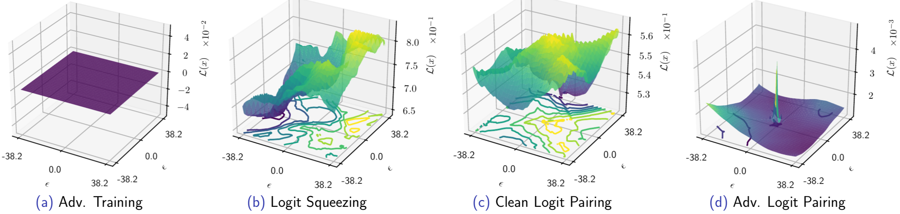
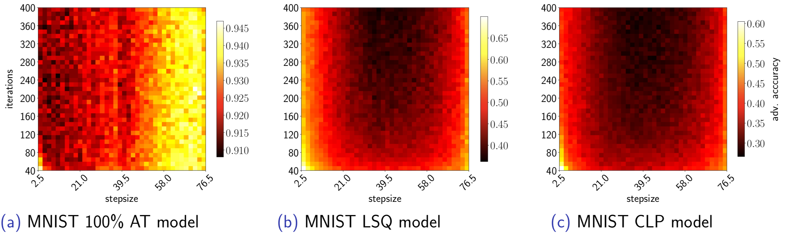
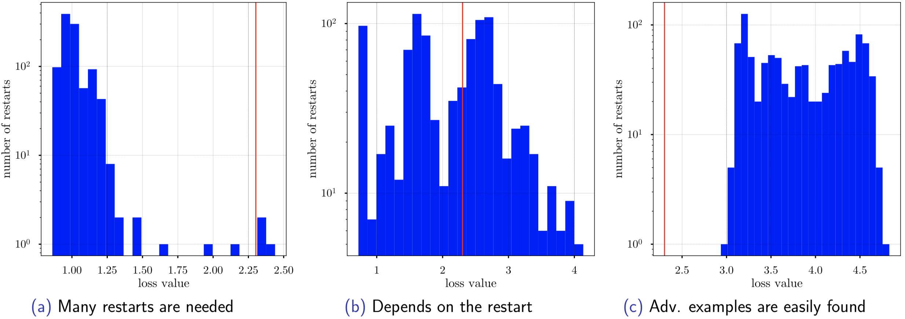

# [Logit Pairing Methods Can Fool Gradient-Based Attacks](https://arxiv.org/abs/1810.12042) 
#### [Presented at NeurIPS 2018 Workshop on Security in Machine Learning](https://secml2018.github.io/) 
#### Marius Mosbach*, Maksym Andriushchenko*, Thomas Trost, Matthias Hein, Dietrich Klakow
#### Saarland University and University of Tübingen


## Main findings
The proposed logit regularization methods in ["Adversarial Logit Pairing"](https://arxiv.org/abs/1803.06373) distort the input loss surface which makes gradient-based attacks difficult.



We highlight that a proper evaluation of the adv. robustness is still an unresolved task.
The PGD attack with the default settings is not necessarily a strong attack. Testing different attack hyperparameters (the number of iterations, stepsize) is crucial when evaluating the robustness of a new defense.


Performing many random restarts is very important when an attack deteriorates the loss surface. Below is an example of the loss values achieved by the PGD attack on different test points (a CLP model, MNIST). Using only 1 random restart (a standard practice) may be not sufficient to find an adversarial example.

The vertical red line denotes the loss value −ln(0.1), which guarantees that for this and a higher value of the loss
we find an adversarial example.


## Results and models
In the table below, we provide our independently trained models on MNIST, CIFAR-10, and Tiny ImageNet together with the [Fine-tuned Plain + ALP LL]() model released [here](https://github.com/tensorflow/models/tree/master/research/adversarial_logit_pairing).

Note that we could break CLP, LSQ, and some ALP models only by using the PGD attack with many iterations and many random restarts. 
This is computationally expensive, thus an interesting direction is to come up with new attacks that can break such models with less computational efforts. 
For this purposes, we encourage researchers to use the models given below for an evaluation of new attacks.

#### MNIST
| Model                         | Accuracy  | Adversarial accuracy <br> with the baseline attack | Adversarial accuracy <br> with our strongest attack|
| -----------                   | -----:     | -----:     | -----:     |
| [Plain](https://oc.cs.uni-saarland.de/owncloud/index.php/s/7SppqtzC5PB8kz4)                     | **99.2%** | 0.0%      | 0.0%      |
| [CLP](https://oc.cs.uni-saarland.de/owncloud/index.php/s/w2yegcfx8mc8kNa)                       | 98.8%     | 62.4%     | 4.1%      |
| [LSQ](https://oc.cs.uni-saarland.de/owncloud/index.php/s/a5ZY72BDCPEtb2S)                       | 98.8%     | 70.6%     | 5.0%      |
| [Plain + ALP](https://oc.cs.uni-saarland.de/owncloud/index.php/s/Sm2zqLwCBp8JH7z)               | 98.5%     | 96.0%     | 88.9%     |
| [50% AT + ALP](https://oc.cs.uni-saarland.de/owncloud/index.php/s/XQ4ZSHjWiE4HB3B)              | 98.3%     | **97.2%** | **89.9%** |
| [50% AT](https://oc.cs.uni-saarland.de/owncloud/index.php/s/LCtkkL6kHz4YZLo)                    | 99.1%     | 92.7%     | 88.2%     |
| [100% AT + ALP](https://oc.cs.uni-saarland.de/owncloud/index.php/s/ESXgi3LYfHgNc5F)             | 98.4%     | 96.6%     | 85.7%     |
| [100% AT](https://oc.cs.uni-saarland.de/owncloud/index.php/s/cPA5HFYcgEoskMS)                   | 98.9%     | 95.2%     | 88.0%     |


#### CIFAR-10
| Model                         | Accuracy  | Adversarial accuracy <br> with the baseline attack | Adversarial accuracy <br> with our strongest attack|
| -----------                   | -----:     | -----:     | -----:     |
| [Plain](https://oc.cs.uni-saarland.de/owncloud/index.php/s/NKojskBc5377YbP)                     | **83.0%** | 0.0%      | 0.0%      |
| [CLP](https://oc.cs.uni-saarland.de/owncloud/index.php/s/odcd7FgFdbqq6zL)                       | 73.9%     | 2.8%      | 0.0%      |
| [LSQ](https://oc.cs.uni-saarland.de/owncloud/index.php/s/EYnbHDeMbe4mq5M)                       | 81.7%     | **27.0%** | 1.7%      |
| [Plain + ALP](https://oc.cs.uni-saarland.de/owncloud/index.php/s/MPneF76Njp2ZmEj)               | 71.5%     | 23.6%     | **10.7%** |
| [50% AT + ALP](https://oc.cs.uni-saarland.de/owncloud/index.php/s/ToYDkSQoeQxqfyX)              | 70.4%     | 21.8%     | 10.5%     |
| [50% AT](https://oc.cs.uni-saarland.de/owncloud/index.php/s/P66RwZjdKxsjCgr)                    | 73.8%     | 18.6%     | 7.3%      |
| [100% AT + ALP](https://oc.cs.uni-saarland.de/owncloud/index.php/s/MyPkqTf8JSWtsx7)             | 65.7%     | 19.0%     | 6.4%      |
| [100% AT](https://oc.cs.uni-saarland.de/owncloud/index.php/s/pBr62SQzCgK2iR2)                   | 65.7%     | 16.0%     | 6.7%      |


#### Tiny ImageNet
| Model                         | Accuracy  | Adversarial accuracy <br> with the baseline attack | Adversarial accuracy <br> with our strongest attack|
| -----------                   | -----:    | -----:     | -----:     |
| [Plain](https://oc.cs.uni-saarland.de/owncloud/index.php/s/PSDQwxyix5PAkwM)                     | 53.0%     | 3.9%      | 0.4%      |
| [CLP](https://oc.cs.uni-saarland.de/owncloud/index.php/s/X4M97pp5ZMMdDnF)                       | 48.5%     | 12.2%     | 0.7%      |
| [LSQ](https://oc.cs.uni-saarland.de/owncloud/index.php/s/KLC97NCebtyKXtS)                       | 49.4%     | 12.8%     | 0.8%      |
| [Plain + ALP LL](https://oc.cs.uni-saarland.de/owncloud/index.php/s/5jjw9CzABWGXrKz)            | 53.5%     | 17.2%     | 0.8%      |
| [Fine-tuned Plain + ALP LL](https://oc.cs.uni-saarland.de/owncloud/index.php/s/x6M6aZCK8GYEQgf) | **72.0%** | **31.8%** | 3.6%      |
| [50% AT LL](https://oc.cs.uni-saarland.de/owncloud/index.php/s/8FKqzd862bm6b5k)                 | 46.3%     | 25.1%     | 9.4%      |
| [50% AT LL + ALP LL](https://oc.cs.uni-saarland.de/owncloud/index.php/s/qp3o4GLCQiB69Jb)        | 45.2%     | 26.3%     | 13.5%     |
| [100% AT LL](https://oc.cs.uni-saarland.de/owncloud/index.php/s/xcMBbdwt7xKBj4m)                | 41.2%     | 25.5%     | 16.3%     |
| [100% AT LL + ALP LL](https://oc.cs.uni-saarland.de/owncloud/index.php/s/b4fsTjiPQ6DgF6t)       | 37.0%     | 25.4%     | **16.5%** |


## Requirements
* For Tiny ImageNet code: TensorFlow 1.8 and Python 2.7
* For MNIST and CIFAR-10 code: Tensorflow 1.8, PyTorch0.4, CleverHans 3.0.1, and Python 3.5
* In order to set up [Tiny ImageNet](https://tiny-imagenet.herokuapp.com/) 
dataset in the correct format (tf.records), run `tiny_imagenet.sh`.


## How to run the code

### Tiny ImageNet code
You can find examples on how to run the code for Tiny ImageNet in the following scripts:
* `train.sh` Trains a model from scratch. 
* `eval.sh` Evaluates an existing model (see the table for the particular Tiny ImageNet models). Note, that with this script you might not be able to
reproduce the results from the paper exactly, since for those evaluations the random seed was not fixed.
But the results are expected to be very close to the reported ones.

More details are available by `python <script> --helpfull`.

Note, that the code for Tiny ImageNet is based on the [official code release](https://github.com/tensorflow/models/tree/c42ce18ce500893f2aa0bf08828a9d0f8083fbae/research/adversarial_logit_pairing) 
of "Adversarial Logit Pairing" paper made in July 2018.

### MNIST/CIFAR-10 code

You can find examples on how to run the code for Tiny ImageNet in the following scripts:
* `train.sh` Trains a model from scratch. 
* `eval.sh` Evaluates an existing model

More details are available by `python train.py --help` and `python eval.py --help`.


## Contact
Please contact [Marius Mosbach](https://github.com/mmarius) or [Maksym Andriushchenko](https://github.com/max-andr)
regarding this code.

## Citation
```
@article{mosbach2018logit,
  title={Logit Pairing Methods Can Fool Gradient-Based Attacks},
  author={Mosbach, Marius and Andriushchenko, Maksym and Trost, Thomas and Hein, Matthias and Klakow, Dietrich},
  conference={NeurIPS 2018 Workshop on Security in Machine Learning},
  year={2018}
}
```
